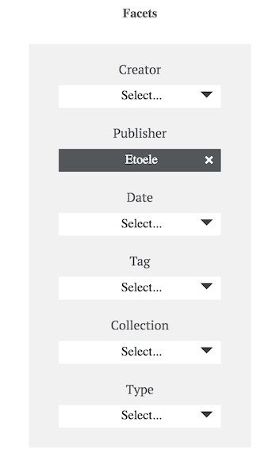

# Omeka Facets Plugin

This is a plugin, for the [Omeka Classic](https://omeka.org/classic/) Publishing platform.

Allows you to insert a Facets block made of Option blocks containing available metadata values extracted from browsing context.



## Credits

This Development is part of the [Armarium](https://www.armarium-hautsdefrance.fr/) Project, managed by the french association [AR2L Hauts de France](http://www.ar2l-hdf.fr/).

## How to Use

## Install the FacetsPlugin

Copy to your Omeka plugins Folder, should be :
```
/plugins/Facets
```

Then Install the plugin from the Admin/extensions page.

## (Eventually) Customize your Theme

Facets will appear in the Items browse page, where you have set the public_items_browse Hook.

You can Edit your Theme (should be in YOUR_THEME/items/browse) & place the plugin hook where you need to display the facets.

```php
<?php fire_plugin_hook('public_items_browse', array('items' => $items, 'view' => $this)); ?>
```

## Licence
MIT Licence, please credit AR2L [AR2L Hauts de France](http://www.ar2l-hdf.fr/)
